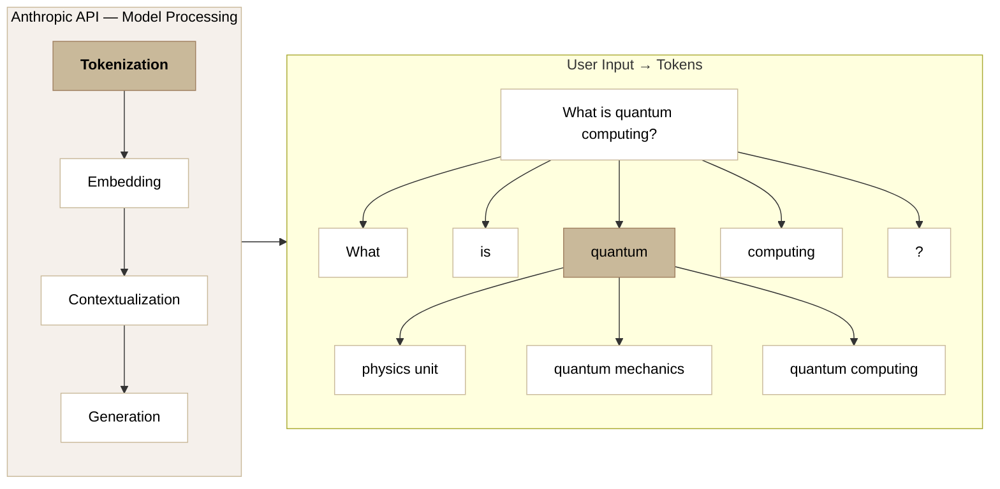
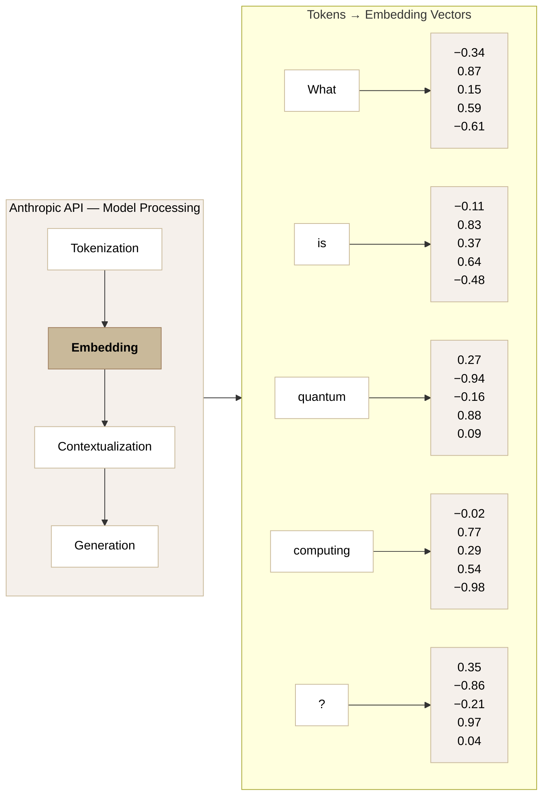
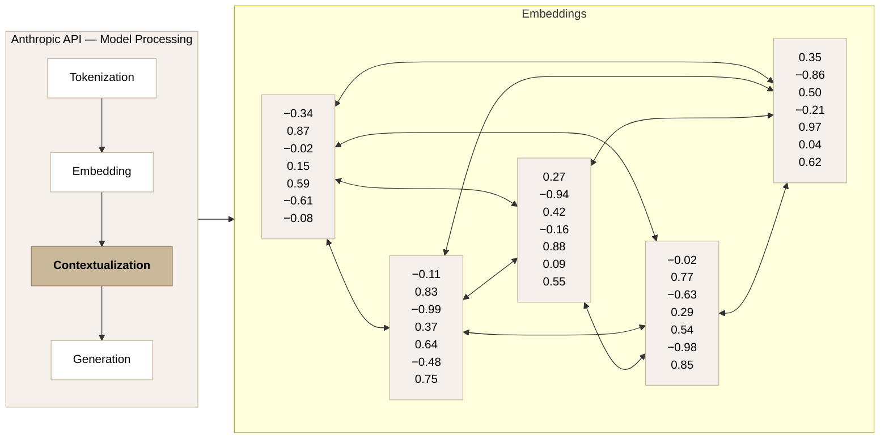
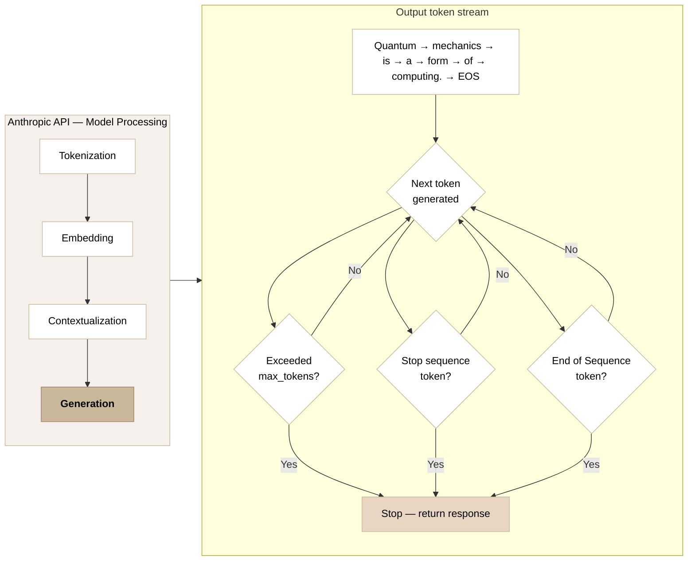
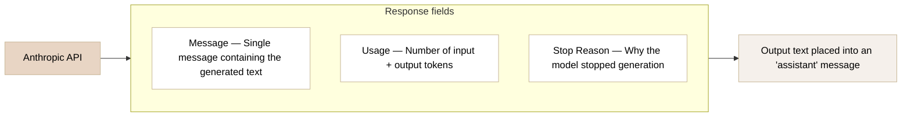

# Anthropic API Request Flow

- [Anthropic API Request Flow](#anthropic-api-request-flow)
  - [API Request](#api-request)
  - [Tokenization](#tokenization)
  - [Embedding](#embedding)
  - [Contextualization](#contextualization)
  - [Generation](#generation)
  - [API Response](#api-response)
  - [References](#references)

## API Request

The client sends a request to the Anthropic API. Requests can be made via the SDK or a plain HTTP call. Input text is placed inside a `"user"` message within the `messages` array.

```mermaid
flowchart LR
    subgraph note["Request shape"]
        direction TB
        n1["Requests can be made through\nan SDK or plain HTTP request"]
        n2["Input text is placed inside a\n'user' message, which is then\nplaced in a list of messages"]
    end

    subgraph fields["Request fields"]
        direction TB
        f1["API Key — Identifies your request to Anthropic"]
        f2["Model — Name of the model to use"]
        f3["Messages — List of messages containing the user's input text"]
        f4["Max Tokens — Limit to how many tokens the model can generate"]
    end

    api["Anthropic\nAPI"]

    note --> fields --> api

    style note fill:#f5f0eb,stroke:#c9b99a,color:#000
    style api fill:#e8d5c4,stroke:#c9b99a,color:#000
    style n1 fill:#fff,stroke:#c9b99a,color:#000
    style n2 fill:#fff,stroke:#c9b99a,color:#000
    style f1 fill:#fff,stroke:#c9b99a,color:#000
    style f2 fill:#fff,stroke:#c9b99a,color:#000
    style f3 fill:#fff,stroke:#c9b99a,color:#000
    style f4 fill:#fff,stroke:#c9b99a,color:#000
```

**Pipeline:** `Request to Server` → **`Request to Anthropic API`** → `Model Processing` → `Response to Server` → `Response to Client`

## Tokenization

The model first breaks the input text into tokens — sub-word units it can process numerically. Each token can carry multiple possible meanings, which are resolved in the embedding step.

**Pipeline:** `Request to Server` → `Request to Anthropic API` → **`Model Processing`** → `Response to Server` → `Response to Client`

## Embedding

Each token is converted into a high-dimensional numeric vector. The full sentence becomes a matrix of vectors — one per token — that the model can compute over.

**Pipeline:** `Request to Server` → `Request to Anthropic API` → **`Model Processing`** → `Response to Server` → `Response to Client`

## Contextualization

The model uses attention to let every token look at every other token's embedding. This resolves ambiguity — the meaning of "quantum" shifts depending on surrounding words like "computing" or "mechanics."

**Pipeline:** `Request to Server` → `Request to Anthropic API` → **`Model Processing`** → `Response to Server` → `Response to Client`

## Generation

The model generates output tokens one at a time. After each token, it checks whether it should stop.

**Pipeline:** `Request to Server` → `Request to Anthropic API` → **`Model Processing`** → `Response to Server` → `Response to Client`

## API Response

The API returns a response. The output text is placed into an `"assistant"` message.

**Pipeline:** `Request to Server` → `Request to Anthropic API` → `Model Processing` → **`Response to Server`** → `Response to Client`

## References

- [Accessing the API](https://anthropic.skilljar.com/claude-with-the-anthropic-api/287726)
