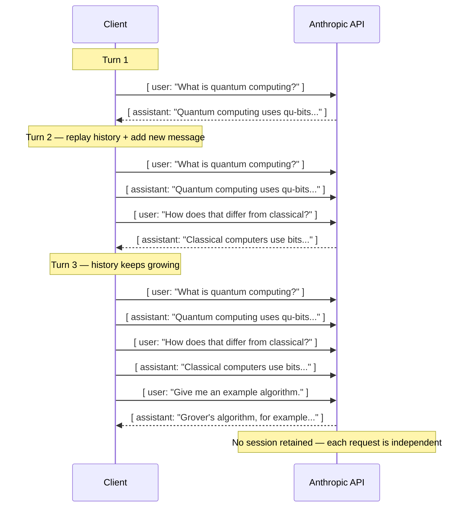
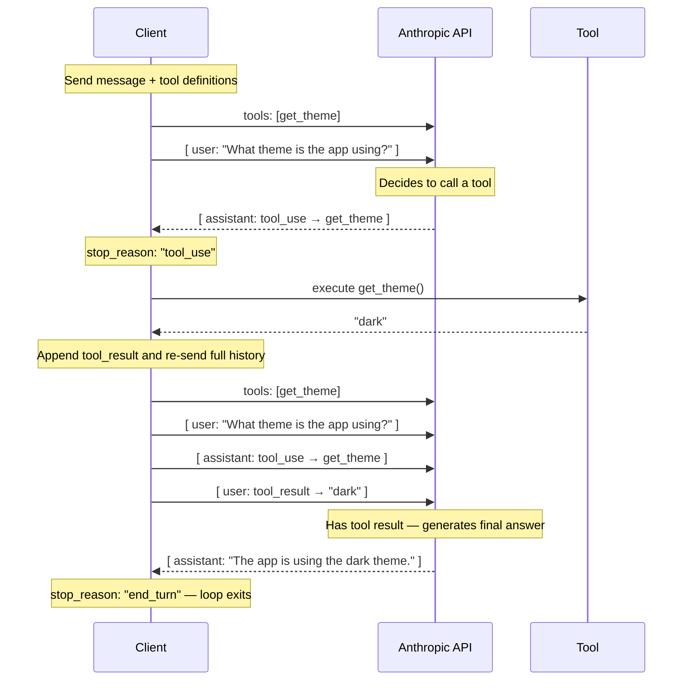
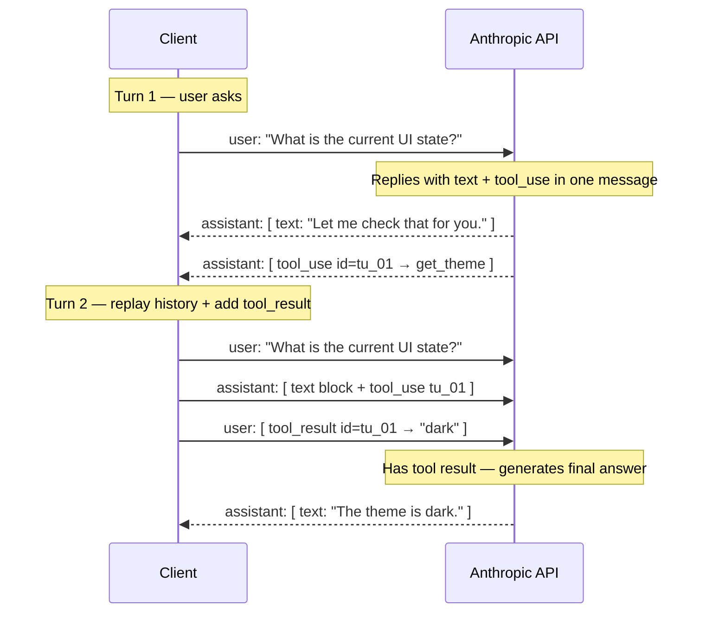
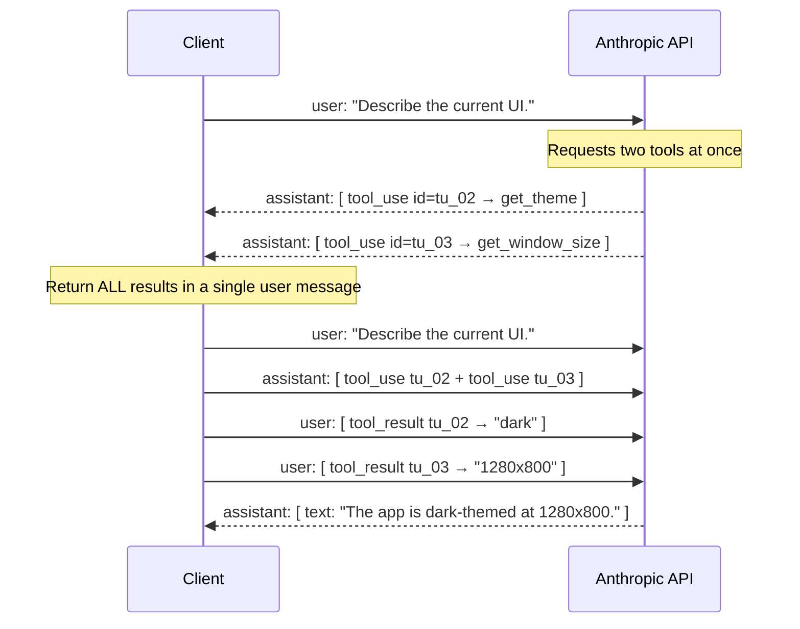
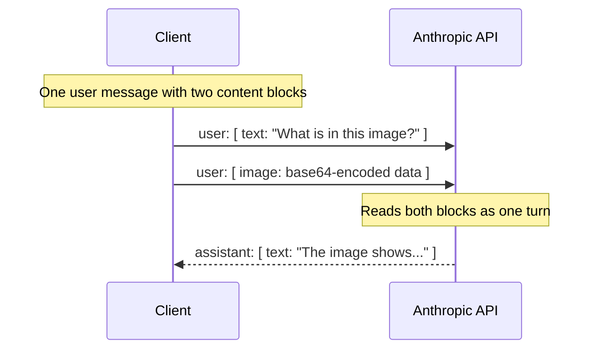

# Messages Shape

- [Messages Shape](#messages-shape)
  - [Stateless API](#stateless-api)
  - [Tool Use — Agent Loop](#tool-use--agent-loop)
  - [Multi-Block Messages](#multi-block-messages)
    - [Parallel Tool Use](#parallel-tool-use)
    - [Text + Image Blocks](#text--image-blocks)

## Stateless API

The Anthropic API is **stateless**: it holds no memory between calls. Every request must carry the full conversation history. The client is responsible for accumulating messages.

## Tool Use — Agent Loop

When the model decides to call a tool, the API returns `stop_reason: "tool_use"` instead of a final answer. The client executes the tool, appends the result, and calls the API again. This loop repeats until `stop_reason: "end_turn"`.

## Multi-Block Messages

A message's `content` field can be an array of blocks instead of a plain string. This lets a single message carry mixed types — text, tool calls, and tool results — in one turn.

### Parallel Tool Use

The API can request multiple tools in a single assistant message. The client must return all results in one `user` message before the next generation.

### Text + Image Blocks

A user message can mix `text` and `image` blocks in the same `content` array, sending both to the model in a single turn.

